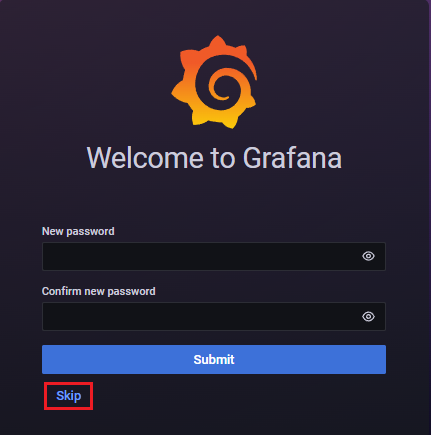
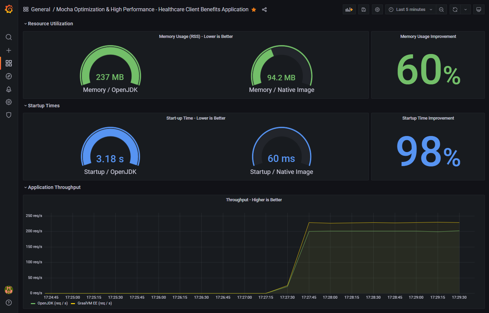

# Java Performance Comparison Dashboard Demo

The goal of this demo is to compare performance of Java applications running in a virtual environment or deployed in containers.  

To access the systems:
```
$ ssh -i ~username/.ssh/ssh-key-graal-demo-1.key opc@129.146.21.243
```

> **NOTE:** You'll need to obtain the necessary key files to access the systems.

### Demo Apps

A simple `primes` demo is provided (on both nodes) but other applications can be added.

> **NOTE:** 
> The `primes` demo has been compiled using Java 17, make certain you're using Java 17.


### Starting the Demo Environment

First, clone this repository:

```
$ git clone https://github.com/swseighman/Java-Perf-Gafana.git
$ cd /home/opc/repos/Java-Perf-Gafana/demo
```

Run `docker-compose` to start all of the services:

```
$ docker-compose up
```

The `primes` demo produces data via `spring-actuator` (see source code) and is consumed by Prometheus. The app runs on port **8080**. Once started, you should begin to see data in the Grafana dashboard.

In addition, `hey` has been installed so that you can run benchmark tests. A script has been provided to start the benchmark tests: 

```
$ ./stress.sh
```

To stop all of the services execute:

```
$ docker-compose stop
```

### Accessing the Prometheus Dashboard

You can access the Prometheus dashboard by browsing to: http://129.146.21.243:9090/


From here, you can execute queries and create graphs.  For example, you can begin typing `node_memory` in the search bar and Prometheus will display the available query options. Enter your query and press the **Execute** button.  In the example below, we're displaying the amount of free memory on the node (`node_memory_MemFree_bytes`):


You can also view which targets are available to provide metrics, from the Prometheus dashboard (http://129.146.21.243:9090/), click on **Status-> Targets**


You will see which targets are up and available:


> **NOTE:** The `spring-actuator` target will show an `UP` state when a demo application is running (otherwise it will show `Down`).

To learn more about Prometheus, see the docs [here](https://prometheus.io/docs/introduction/overview/).

### Accessing the Grafana Dashboard

To access the Grafana dashboard, browse to: http://129.146.21.243:3000/login


Credentials:

**Login:** admin

**Password:** admin

You can **Skip** chaning the admin password:



By default, the **Mocha Optimization and High Performance** dashboard will be displayed which includes a collection of metrics scraped from:

* Prometheus
* Node (system metrics)
* Cadvisor (containers)
* Spring-actuator (demo app)



Each metric displayed in the dashboard is considered a **panel**. All of the dashboard panels are customizable. 

For example, if you place your mouse over the top of the **CPUs** panel, an arrow will appear, clicking on the arrow will reveal a menu.  In that menu, choose **Edit**:


Choose your **data source**, enter a query in the **Metrics Browser** box, choose your **graph type** and click **Apply**.


Additionally, panels can be assembled in rows. Each row of graphs can be expanded/collapsed by clicking on the arrows for the corresponding rows:


To learn more about Grafana, see the docs [here](https://grafana.com/docs/).
